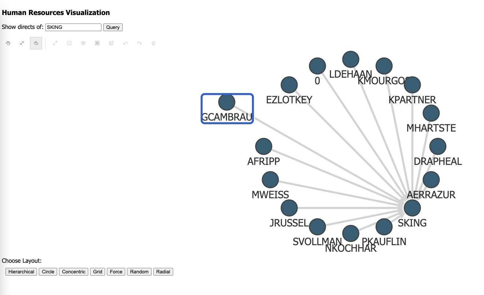

# Traceability Demo Application 

An example Java web application based on [Micronaut](https://docs.micronaut.io/) which embeds Oracle's Graph Visualization library. The server queries the graph data from an Oracle Database using [PGQL](https://pgql-lang.org/).

The key source files to look at are

* `src/main/resources/public/index.html`: the HTML file served in the browser embedding the visualization library
* `src/main/java/com/oracle/example/TraceController.java`: implements the REST endpoints called by `index.html` 
* `src/main/java/com/oracle/example/GraphClient.java`: wraps the graph server APIs, called by HRController

## Pre-requisites

1. Oracle JDK 11 (or OpenJDK 11)
2. A running Oracle Graph Server. Download [from oracle.com](https://www.oracle.com/database/technologies/spatialandgraph/property-graph-features/graph-server-and-client/graph-server-and-client-downloads.html) 
   and install [as per documentation](https://docs.oracle.com/en/database/oracle/property-graph/22.4/spgdg/deploying-graph-visualization-application.html).
3. A running Oracle Database (e.g. [Autonomous Database](https://www.oracle.com/autonomous-database/))
4. This example uses the [Human Resources sample dataset](https://github.com/oracle-samples/db-sample-schemas).
   Import this dataset into your database  [as per instructions on github](https://github.com/oracle-samples/db-sample-schemas).
5. Create a graph out of the dataset using the following statement:

```
CREATE PROPERTY GRAPH trace_all
  VERTEX TABLES (
    trace_bom_node
      KEY (id)
      LABEL part
      PROPERTIES (id, part_id, lot)
  , trace_scn_node
      KEY (id)
      LABEL place
      PROPERTIES (id, place_id, lot)
  )
  EDGE TABLES (
    trace_bom_edge
      KEY (id)
      SOURCE KEY(child_id) REFERENCES trace_bom_node
      DESTINATION KEY(parent_id) REFERENCES trace_bom_node
      LABEL part_of
      NO PROPERTIES
  , trace_scn_edge
      KEY (id)
      SOURCE KEY(src_id) REFERENCES trace_scn_node
      DESTINATION KEY(dst_id) REFERENCES trace_scn_node
      LABEL supplied_to
      NO PROPERTIES
  , trace_b2s_edge
      KEY (id)
      SOURCE KEY(part_id) REFERENCES trace_bom_node
      DESTINATION KEY(place_id) REFERENCES trace_scn_node
      LABEL produced_at
      NO PROPERTIES
  )
```

You can run this statement using a PGQL client of your choice. If you're using the Autonomous Database, we recommend
to use [Graph Studio](https://docs.oracle.com/en/cloud/paas/autonomous-database/csgru/graph-studio-interactive-self-service-user-interface.html).

On premise, we recommend to use the [PGQL Plug-in for SQLcl](https://docs.oracle.com/en/database/oracle/sql-developer-command-line/20.2/sqcug/using-pgql-plug-sqlcl.html)
or [SQL Developer](https://docs.oracle.com/en/database/oracle/property-graph/22.4/spgdg/property-graph-support-sql-developer1.html).

## Usage

1. Clone this repository 
2. Download the "Oracle Graph Visualization library" [from oracle.com](https://www.oracle.com/database/technologies/spatialandgraph/property-graph-features/graph-server-and-client/graph-server-and-client-downloads.html)
3. Unzip the library into the `src/main/resources/public` directory. For example:

```
unzip oracle-graph-visualization-library-23.1.0.zip -d src/main/resources/public/
```

4. Run the following command to start the example app locally:

```
./gradlew run --args='-oracle.graph-server.url=<graph-server-url> -oracle.graph-server.jdbc-url=<jdbc-url> -oracle.graph-server.username=<username> -oracle.graph-server.password=<password'
```

with

* `<graph-server-url>` being the URL of the Graph Server, e.g. `https://myhost:7007`
* `<jdbc-url>` being the JDBC URL of the Oracle Database the Graph Server should connect to, e.g. `jdbc:oracle:thin:@myhost:1521/orcl` 
* `<username>` being the Oracle Database username to authenticate the example application with the Graph Server, e.g. `scott`
* `<password>` being the Oracle Database password to authenticate the example application with the Graph Server, e.g. `tiger`

Then open your browser at `http://localhost:8080`.

When you click on the <em>Query</em> button, a request is made to `/trace/by_str`, which fetches the tree starting from the given part (by default `P1112`) from the TRACE_ALL graph using a PGQL query. 



When you right-click on one of the resulting nodes and then select <em>Expand</em>, a request to `/hr/by_ids` is being made, which fetches the tree from the selected node via another PGQL query.

## Troubleshooting

If you get any errors, 
* check the log output from the server on the terminal where the Gradle command is running
* use browser debug tools (e.g. Chrome Developer Tools) to inspect request/response and console logs